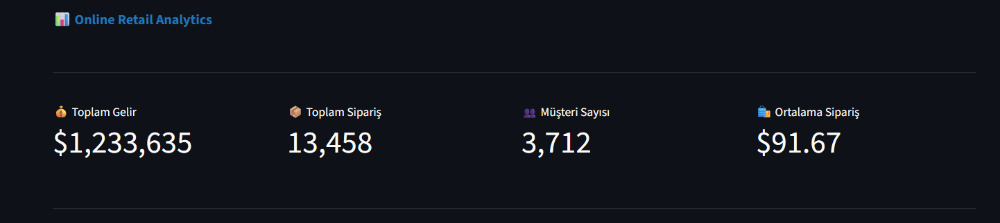
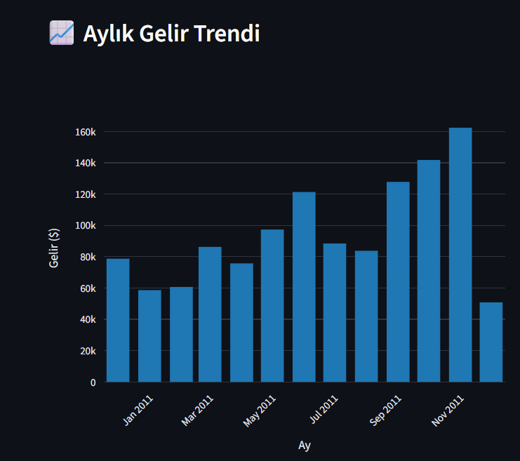
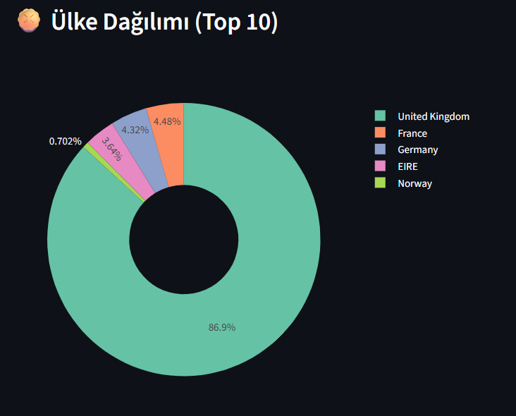

# 🛒 E-Commerce Sales Dashboard

> Interactive e-commerce sales dashboard built with real retail data

## 📊 About This Project

This is a data science portfolio project featuring an interactive e-commerce analytics dashboard. It demonstrates my skills in:
- **Data Visualization**: Creating interactive charts with Plotly
- **Web Development**: Building apps with Streamlit
- **Data Cleaning**: Processing real-world datasets
- **Business Intelligence**: Deriving actionable insights from data

## 🎯 Features

- 📈 **Monthly Revenue Trend** - Track sales performance over time
- 🌍 **Country Distribution** - Analyze sales by geographic region  
- 🏆 **Top Products** - Identify best-selling items
- 🕐 **Hourly Analysis** - Understand peak shopping hours
- 📅 **Day-of-Week Analysis** - Discover weekly patterns
- 💵 **Price Distribution** - Analyze product pricing
- 🔍 **Interactive Filters** - Filter by country in real-time

## 🛠️ Tech Stack

## 📦 Installation 

**Clone the repository**
git clone https://github.com/nehiralgan/ecommerce-dashboard.git
cd ecommerce-dashboard

**Create virtual environment**
python -m venv venv

**Activate virtual environment**
venv\Scripts\activate  # Windows
source venv/bin/activate  # Mac/Linux

**Install dependencies**
pip install -r requirements.txt

**Run the application**
streamlit run app.py

## 📸 Screenshots

**Dashboard Overview**

**Monthly Revenue Trend**

**Country Distribution**
